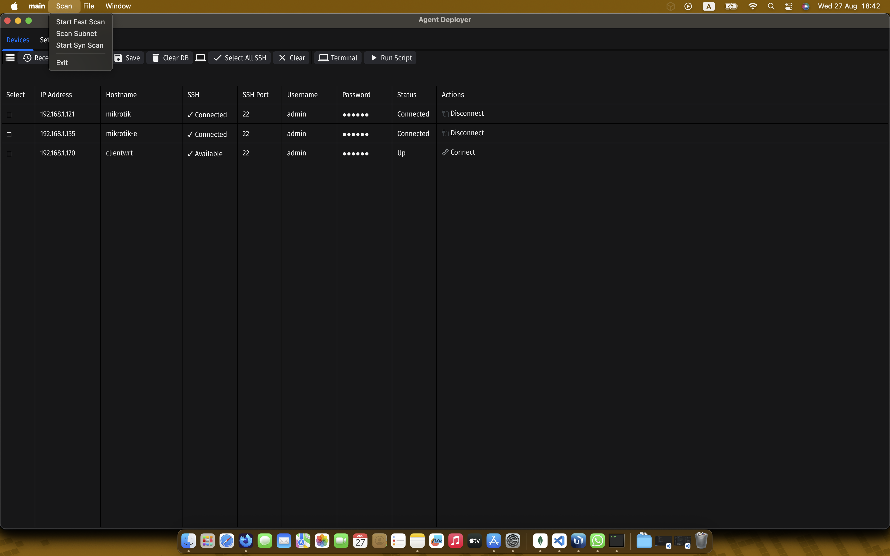

# ISP App Client


A powerful and intuitive desktop application for managing network devices with ease. Built with Go and the Fyne toolkit, this app provides a seamless experience for network administrators and enthusiasts.

  <!-- Replace with your actual screenshot -->

## ✨ Features

- **Device Discovery:** Automatically scan your network to find devices.
- **SSH Terminal:** Open an SSH terminal to any connected device.
- **Multi-Device Scripting:** Run scripts on multiple devices simultaneously.
- **Device Management:** Save, load, and manage your device list.
- **Cross-Platform:** Build and run on macOS, Linux, and Windows.

## 🚀 Getting Started

### Prerequisites

- [Go](https://golang.org/doc/install)
- [Fyne](https://developer.fyne.io/started/)

### Installation & Running

1.  **Clone the repository:**
    ```sh
    git clone https://github.com/ispapp/psshclient.git
    cd psshclient
    ```

2.  **Run the application:**
    ```sh
    make run
    ```

## 📦 Building for Production

Create distributable packages for different operating systems:

- **macOS:**
  ```sh
  make build-mac
  ```

- **Linux:**
  ```sh
  make build-linux
  ```

- **Windows:**
  ```sh
  make build-win
  ```

## 🤝 Contributing

```
# Script Library Contribution Guidelines
# =====================================
# 
# This YAML file contains a collection of network administration scripts
# that can be used with the PSSH Client application.
#
# HOW TO CONTRIBUTE:
# -----------------
# 1. Fork the repository at: https://github.com/ispapp/psshclient
# 2. Add your script following the structure below
# 3. Submit a pull request with your changes
# 4. Include a clear description of what your script does
#
# SCRIPT STRUCTURE:
# ----------------
# Each script must follow this exact YAML structure:
#
# - name: "Your Script Name"
#   description: "Brief description of what the script does"
#   content: |
#     your script commands here
#     line 1
#     line 2
#   category: "Category"
#
# NAMING CONVENTIONS:
# ------------------
# - name: Use descriptive names that clearly indicate the script's purpose
# - description: Keep it concise but informative (under 80 characters)
# - content: Use proper indentation and include comments where helpful
# - category: Use one of the existing categories or propose a new one
#
# AVAILABLE CATEGORIES:
# --------------------
# - MikroTik: RouterOS specific commands
# - Firewall: Security and firewall configurations
# - VPN: VPN setup and management scripts
# - Cloud: Cloud service integrations
# - System: General system administration
# - Network: Network diagnostics and configuration
# - Wireless: WiFi and wireless configurations
# - Monitoring: Monitoring and alerting scripts
# - Security: Security hardening and auditing
# - QoS: Quality of Service configurations
# - Hotspot: Captive portal and hotspot management
# - Linux: Linux system administration
#
# SCRIPT GUIDELINES:
# -----------------
# 1. Test your scripts thoroughly before submitting
# 2. Include error handling where appropriate
# 3. Use comments to explain complex operations
# 4. Avoid hardcoded values - use placeholders like "YOUR_VALUE_HERE"
# 5. Ensure scripts are idempotent when possible
# 6. Follow security best practices
# 7. Include proper cleanup commands if needed
#
# SECURITY CONSIDERATIONS:
# -----------------------
# - Never include real passwords, keys, or sensitive data
# - Use placeholder values like "YOUR_PASSWORD_HERE"
# - Include security warnings in descriptions if needed
# - Test scripts in isolated environments first
#
# QUALITY STANDARDS:
# -----------------
# - Scripts must be functional and tested
# - Code should be clean and well-commented
# - Descriptions must be accurate and helpful
# - Follow the existing formatting style
# - No malicious or destructive code
```

## 📄 License

This project is licensed under the MIT License. See the [LICENSE](./LICENSE) file for details.
